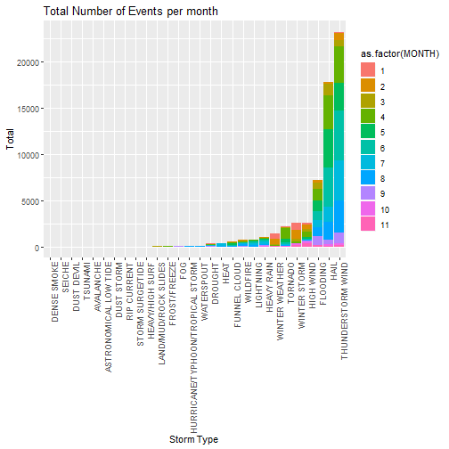

Weather Event Types in the United States in 2011
========================================================
author: Nicolas Flinta
date: 01/03/2019
autosize: true
font-family: 'Helvetica'

2. Summary
========================================================

This presentation covers the following aspects:

- The application can be run at: <https://nicoflinta.shinyapps.io/rshinyapp2/>
- The presentation is in Rpubs at: you are already there! :)
- The app code is in GitHub at: <https://github.com/nicoflinta/PresentationPitch>


3. Background Information
========================================================

The data for this assignment come the U.S. National Oceanic and Atmospheric Administration 's (NOAA) storm database. This database tracks characteristics of major storms and weather events in the United States, including when and where they occur, as well as estimates of any fatalities, injuries, and property damage.

The events in the database start in the year 1950 and end in November 2011. For the purpose of this demo, only data for 2011 was considered.

Data information at <https://d396qusza40orc.cloudfront.net/repdata%2Fpeer2_doc%2Fpd01016005curr.pdf>


```r
str(health_impact)
```

```
'data.frame':	3215 obs. of  12 variables:
 $ X                   : int  1 2 3 4 5 6 7 8 9 10 ...
 $ WEATHEREVENT        : Factor w/ 28 levels "ASTRONOMICAL LOW TIDE",..: 1 1 1 1 1 1 2 2 2 2 ...
 $ STATE               : Factor w/ 67 levels "AK","AL","AM",..: 12 19 22 43 50 55 8 8 9 9 ...
 $ MONTH               : int  2 8 9 2 2 7 2 4 1 2 ...
 $ count               : int  5 1 1 14 4 1 1 1 2 2 ...
 $ fatalities_tot      : int  0 0 0 0 0 0 0 2 0 0 ...
 $ injuries_tot        : int  0 0 0 0 0 0 0 0 0 0 ...
 $ total_healt         : int  0 0 0 0 0 0 0 2 0 0 ...
 $ prop_damage_tot     : num  0 0 0 0 0 0 55000 0 0 0 ...
 $ crop_damage_tot     : num  0 0 0 0 0 0 0 0 0 0 ...
 $ prop_damage_tot_mill: num  0 0 0 0 0 0 0.055 0 0 0 ...
 $ crop_damage_tot_mill: num  0 0 0 0 0 0 0 0 0 0 ...
```


4. The Data
========================================================
The data used for the application only considers observations from January to November 2011. I created an application to allow users to see the data for the States they chose and to narrow it down to specific months.

Due to simplicity for the presentation, these are the only two parameters available.


```r
ggplot(health_impact, aes(x = reorder(WEATHEREVENT, count, function(x) { sum(x) }), y = count, fill = as.factor(MONTH))) +
    geom_bar(stat = 'identity') +
    labs(x = "Storm Type", y = "Total") +
    ggtitle("Total Number of Events per month") +
    theme(axis.text.x = element_text(angle = 90, hjust = 1)) 
```




5. Server Calculations
========================================================
The application takes the Months and States code from the data to build the drop downs. After each drop down is changed, the server side code will refresh the plots with the relevant criteria.

ui.R (Extract)


```r
      selectInput("month", "Select Month:", choices = month_list, selected = month_list[1]),
      selectInput("state", "Select a State:", choices = state_list, selected = state_list[1])),
```

server.R (Extract)


```r
shinyServer(function(input, output) {
    output$distPlot <- renderPlot({
        p <- ggplot(subset(health_impact, health_impact$STATE == input$state & health_impact$MONTH == input$month), aes(x = reorder(WEATHEREVENT, count, function(x) { sum(x) }), y = count, fill = WEATHEREVENT)) +
        geom_bar(stat = 'identity') +
        ggtitle("Total number of Recorded Weather Events") +
        labs(x = "Storm Type", y = "Total") +
        theme(axis.text.x = element_text(angle = 90, hjust = 1)) +
        coord_flip()
        p
    })
})
```
